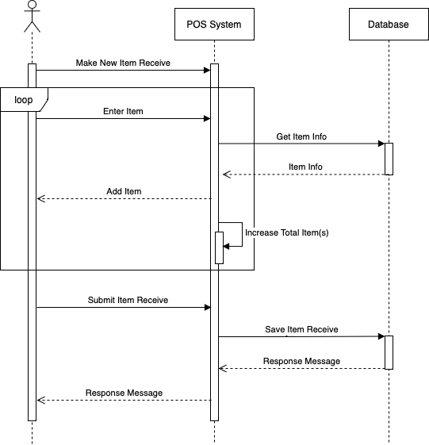

# Developer Guide

## Table of Contents

1. [Acknowledgement](#1-acknowledgement)
2. [Design](#2-design)
    + [Software Design and Architecture Diagram](#software-design-and-architecture-diagram)
    + [Entity Relationship Diagram](#entity-relationship-diagram)
3. [Implementation](#3-implementation)
    + [Use Cases Diagram](#use-cases-diagram)
    + [UML Class Diagrams](#uml-class-diagrams)
    + [Sequence Diagrams](#sequence-diagrams)
4. [Product Scope](#4-product-scope)
5. [User Stories](#5-user-stories)
6. [Non-Functional Requirements](#6-non-functional-requirements)
7. [Glossary](#7-glossary)
8. [Unit and Integration Tests](#8-unit-and-integration-tests)
9. [Future Extensions](#9-future-extensions)

---

## 1. Acknowledgement

+ The IT5503 Team (Professor and Teaching Assistants) For their guidance in teaching us concepts of Software Engineering and OOP

###### [Back to table of contents](#table-of-contents)

## 2. Design

### Software Design and Architecture Diagram

Breakdown of each component and its role in the application:

+ `FrontEnd(UI)`: This serves as the application's entry point, responsible for displaying the application's graphical user interface (GUI) and handling user interactions, which are then transmitted to the Frontend Server component.

+ `Frontend(Server)`: This component handles user interactions by generating Commands directed to the Controller. It receives commands from the FrontEnd UI, requests data from the Controller, and subsequently delivers the retrieved data back to the FrontEnd UI.

+ `Controller`: This component retrieves data requested by the Frontend Server by creating respective objects from the Model component. It then utilizes these objects to request data from the database component.

+ `Models`: The Model component constructs essential objects for different parts of the application. It acts as a crucial bridge within the Controller, facilitating connections with the database.

+ `Database`: This component retrieves the required data that the Controller needs from the SQLite Database. It establishes a connection with the database and executes SQL queries to fetch and manipulate data as necessary.

+ `UnitTests`: These components are designed for testing the functionality of the Controller and Models to ensure their proper operation within the system.

Overall, The Software Design and Architecture Diagram illustrates the collaborative operation of various components within the Point of Sale application, resulting in a fully functional system equipped with a Graphical User Interface. The design emphasizes modularity and loose coupling among the components, enabling convenient modification and seamless extension of the application.

### Entity Relationship Diagram

Here is a simplified explanation of the entities and their relationships in the ER diagram for a Point of Sale (POS) system:

#### Entities:

+ `category_tbl`: Represents different categories of items, such as `Cosmetics`, `Electronics`, etc.

+ `item_tbl`: Represents individual products available for sale, with attributes like item_id, name, price, etc.

+ `item_receive_tbl`: Represents the act of receiving new items into the inventory.

+ `item_receive_details_tbl`: Stores details about the items received, such as qty, etc.

+ `damage_loss_tbl`: Represents incidents where items are damaged or lost.

+ `damage_loss_details_tbl`: Stores details about the damaged or lost items, including the extent of damage or the reason for loss.

+ `sale_tbl`: Represents a sale transaction made at the POS.

+ `sale_details_tbl`: Stores details about the items sold in a particular sale, such as qty, price, etc.

+ `user_tbl`: Represents individuals who use the POS system.

+ `user_role_tbl`: Represents different roles that users can have, such as `Cashier`, `Manager`, etc.

+ `user_role_permissions_tbl`: Specifies the permissions associated with each user role, defining what actions users with a specific role can perform in the system.

+ `log_tbl`: Records activities related to sale, damage loss, and item receive vouchers.

#### Relationships:

+ A category can have multiple items, but an item belongs to only one category (one-to-many relationship between `category_tbl` and `item_tbl`).

+ An item can be received multiple times, but each item receive entry is associated with one item (one-to-many relationship between `item_tbl` and `item_receive_tbl`).

+ Each item in `item_tbl` can be received multiple times, but each receipt entry in `item_receive_details_tbl` is associated with one item.

+ Similar relationships can be established between `item_tbl` and `damage_loss_details_tbl`, `item_tbl` and `sale_details_tbl`.

+ Each item receive entry in `item_receive_tbl` has multiple details in `item_receive_details_tbl` (one-to-many relationship between `item_receive_tbl` and `item_receive_details_tbl`).

+ Similar relationships can be established between `damage_loss_tbl` and `damage_loss_details_tbl`, `sale_tbl` and `sale_details_tbl`.

+ `users_tbl` and `user_roles_tbl` are related, allowing each user to have a specific role.

+ The `user_roles_tbl` and `user_role_permissions_tbl` are related, associating permissions with each user role.

+ log_tbl is related to `users_tbl` to record the user associated with each log entry.

###### [Back to table of contents](#table-of-contents)

## 3. Implementation

### Use Cases Diagram

Above Use Cases Diagram provides an overview of the POS system's workflow based on user roles.

Upon user login with the correct account credentials, the system verifies the password and user role and then it will give the access to the different parts of the system according to that role

+ `Admin`: Users assigned this role possess comprehensive access to all system components, including the capability to create new roles and define specific access permissions for each role. They have complete control over the entire system.

+ `Manager`: Managers enjoy almost all the access to the system, excluding privileges related to managing user roles, user accounts, and store configuration settings.

+ `Cashier`: This role is limited only to accessing the sale component, as designated by the Admin.

Note: The roles and associated access rights can be customized and updated manually by the Admin for specific requirements, beyond the provided examples.

### UML Class Diagram

#### Category Class 

1. **Overview**
   - The `Category` class is an integral part of a point of sale (POS) system, designed to handle categories of items or services. It ensures that each category is uniquely identified (`category_id`) and has a properly validated name (`category_name`). The class's design allows for efficient management and retrieval of category-specific information, which is crucial in organizing products or services in a POS system.

2. **Initialization**
   - Constructor (`__init__`): This method initializes a new instance of the `Category` class.
     - `category_id (str)`: Acts as a unique identifier. It's essential for distinguishing between different categories, especially in systems with a large number of categories.
     - `category_name (str)`: Represents the human-readable name of the category. It's used for display purposes and user interactions.
     - `category_name_can_empty (bool, optional)`: Determines the type of validation for the category name. If set to `True`, it allows for more lenient validation rules. The default value is `False`, indicating stricter validation criteria.

3. **Modification Check**
   - `is_modify` Method: This method checks if the category is intended for modification. It's a safeguard to ensure that only valid categories (with a proper `category_id`) are modified, thus maintaining data integrity.

4. **Properties**
   - Read-Only Accessors: 
     - `category_id`: Allows external entities to safely access the unique identifier of the category.
     - `category_name`: Provides a way to retrieve the validated name of the category, ensuring that any interaction with the category name outside the class adheres to the validation rules.

5. **Validation**
   - `category_name_validate_fun`: A dictionary mapping validation function names to their implementations. This feature provides flexibility, enabling developers to define custom validation logic tailored to specific requirements.

6. **Exception Handling**
   - Error Management: The class is designed to handle errors gracefully.
     - `TypeError` for `category_id`: Ensures that the identifier is always in the correct format, either an integer or a string that can be converted to an integer.
     - `TypeError` for Category Name Validation: Protects the integrity of the category name by enforcing the presence and correct usage of validation functions.

#### DamageLoss Class

1. **Overview**

    The `DamageLoss` class is designed for managing records of damage or loss in a system, typically used in inventory or asset management contexts. It captures essential details like a unique identifier (`damage_loss_id`), voucher number (`voucher_no`), transaction date (`tran_date`), total number of items affected (`total_items`), and the user ID associated with the record (`user_id`). The class includes validation functions to ensure data integrity and provides methods for converting object data into tuples formatted for database operations.

2. **Initialization**

    The `DamageLoss` class is initialized with the following parameters:
    - **damage_loss_id (str):** A unique identifier for the damage or loss record. Defaults to `"0"` if not provided.
    - **voucher_no (str):** The voucher number associated with the transaction. It undergoes validation through `validate_voucher_no`.
    - **tran_date (str):** The date of the transaction. It is validated by `validate_trans_date`.
    - **total_items (str):** The total number of items affected. Validated by `validate_number`.
    - **user_id (str):** The ID of the user associated with the record. Validated by `validate_number_greater_than_zero`.

3. **Database Tuple Conversion**

    Two methods are provided for converting the class data into a tuple format suitable for database operations:
    - `to_tuple_db`: Returns a tuple including all class attributes, including the `damage_loss_id`.
    - `to_tuple_db_without_id`: Returns a tuple of all class attributes except the `damage_loss_id`.

4. **Properties**

    Read-only properties are provided for all attributes:
    - `damage_loss_id`: Returns the unique identifier for the damage or loss record.
    - `voucher_no`: Returns the validated voucher number.
    - `tran_date`: Returns the validated transaction date.
    - `total_items`: Returns the validated total number of items.
    - `user_id`: Returns the validated user ID.

5. **Validation**

    Validation is integral to the `DamageLoss` class:
    - Ensures that the voucher number, transaction date, total items, and user ID are all in their expected formats and meet specific criteria (e.g., user ID must be greater than zero).

6. **Exception Handling**

    While not explicitly stated, it's implied that the validation functions (`validate_voucher_no`, `validate_trans_date`, `validate_number`, `validate_number_greater_than_zero`) may raise exceptions if the inputs do not meet the required criteria. This would help maintain data integrity and prevent invalid data from being processed.

#### DamageLossDetail Class

1. **Overview**
   
   The `DamageLossDetail` class is designed to represent individual entries of damage or loss within a broader damage loss management system. This class is typically used to record specific details about each item that has been damaged or lost, providing a more granular view of an incident. Key attributes include a unique detail identifier (`damage_loss_details_id`), a reference to the overarching damage loss record (`damage_loss_id`), item information (`item`), quantity of loss or damage (`qty`), and additional remarks (`remark`). This class not only links each detailed record to its corresponding damage loss event but also encapsulates relevant data about the affected item.

2. **Initialization**

    Initialization of the `DamageLossDetail` class requires various parameters:
    - **damage_loss_details_id (Any):** A unique identifier for this particular damage or loss detail.
    - **damage_loss_id (Any):** The ID linking this detail to the main damage loss record, validated as a number.
    - **Item (Any):** An `Item` object representing the item involved in the damage or loss.
    - **qty (Any):** The quantity of the item affected, validated as a number greater than zero.
    - **remark (Any):** Additional remarks or notes about this specific damage or loss instance, validated for format and length.

3. **Database Tuple Conversion**

    The class includes methods to format its data for database interactions:
    - `to_tuple_db`: Formats the object's data into a tuple, including the `damage_loss_id` for database storage.
    - `to_tuple_db_without_id`: Similar to `to_tuple_db` but excludes the `damage_loss_details_id`.

4. **Properties**

    The class provides read-only properties for accessing its attributes:
    - `damage_loss_details_id`, `damage_loss_id`, `qty`, and `remark` properties return their respective internal values.
    - Item-related properties (`item_id`, `product_code`, `name`, `price`, `reorder`, `category_id`) offer proxy access to the properties of the embedded `Item` object.
    - `item`: Returns the complete `Item` object instance.

5. **Validation**

    Validation is a critical component of this class:
    - Ensures that all inputs, such as `damage_loss_id` and `qty`, are properly validated for their expected data types and constraints.
    - Additionally, remarks undergo validation to ensure they meet specific format and length requirements.

6. **Exception Handling**

    While specific exception handling details are not provided, the class likely incorporates exception handling through its validation functions, ensuring that invalid data inputs are caught and handled appropriately.

#### Item Class

1. **Overview**

   The `Item` class is designed to represent and manage individual items within an inventory or product catalog system. It encapsulates essential details about each item, such as a unique item identifier (`item_id`), product code (`product_code`), item name (`name`), selling price (`price`), reorder threshold (`reorder`), and associated category information (`category`). Additionally, it holds the cost price (`cost_price`) of the item. This class is crucial for inventory management, enabling accurate tracking and categorization of items.

2. **Initialization**

    The constructor of the `Item` class initializes the object with several parameters:
    - **item_id (str):** The unique identifier for the item. Defaults to `"0"` if not provided.
    - **product_code (str):** The code assigned to the product, validated by `validate_code`.
    - **name (str):** The name of the item, validated as a non-empty string.
    - **price (str):** The selling price of the item, validated by `validate_price`.
    - **reorder (int):** The reorder threshold for the item, validated as a number.
    - **Category (str):** An instance of the `Category` class, representing the category to which the item belongs.
    - **cost_price (int):** The cost price of the item.

3. **Modification Check**

    The `is_modify` method determines whether the item is eligible for modification. It checks if the `item_id` is a positive integer or a string convertible to a positive integer, ensuring that only valid items are modified.

4. **Properties**

    The class provides read-only properties for accessing its attributes:
    - `item_id`, `product_code`, `name`, `price`, `reorder`, `cost_price` return their respective values.
    - Category-related properties (`category_id`, `category_name`) offer access to the corresponding attributes of the embedded `Category` object.
    - `category`: Returns the complete `Category` object instance.

5. **Validation**

    The class incorporates various validation methods to ensure the integrity of the data:
    - Validates the product code, item name, price, and reorder level for correctness and adherence to predefined constraints.
    - Category information is managed and validated through the `Category` class instance.

6. **Exception Handling**

    While explicit exception handling mechanisms are not detailed, the class likely employs exception handling within its validation methods. This would involve raising exceptions for invalid inputs to maintain data accuracy and consistency.

#### ItemReceive Class

1. **Overview**

   The `ItemReceive` class is intended for managing the receipt of items in an inventory or stock management system. This class tracks the receipt of items, including details such as a unique identifier (`item_receive_id`), voucher number (`voucher_no`), transaction date (`tran_date`), total number of items received (`total_items`), and the user ID associated with the transaction (`user_id`). It's an essential component for recording and managing inventory inflows.

2. **Initialization**

    The class is initialized with the following parameters:
    - **item_receive_id (str):** The unique identifier for the item receipt record. Defaults to `"0"` if not provided.
    - **voucher_no (str):** The voucher number associated with the item receipt. Validated by `validate_voucher_no`.
    - **tran_date (str):** The date of the transaction, validated by `validate_trans_date`.
    - **total_items (str):** The total number of items received, validated as a number.
    - **user_id (str):** The ID of the user responsible for the receipt, validated as a number greater than zero.

3. **Database Tuple Conversion**

    The class provides methods to format its data for database operations:
    - `to_tuple_db`: Returns a tuple including all class attributes, suitable for database insertion.
    - `to_tuple_db_without_id`: Returns a tuple of all class attributes except the `item_receive_id`.

4. **Properties**

    Read-only properties provide access to the class's attributes:
    - `item_receive_id`, `voucher_no`, `tran_date`, `total_items`, and `user_id` return their respective values.

5. **Validation**

    The class ensures that all input parameters are properly validated:
    - This includes checking for valid formats and values for voucher number, transaction date, total items, and user ID.

6. **Exception Handling**

    Exception handling is implied through the use of validation functions, ensuring that invalid inputs are identified and handled appropriately.

#### ItemReceiveDetail Class

1. **Overview**

   The `ItemReceiveDetail` class is designed to record detailed information about each individual item received in a transaction, as part of the larger item receipt process. It includes details such as a unique detail identifier (`item_receive_details_id`), the associated item receive ID (`item_receive_id`), an `Item` object containing detailed item information, and the quantity received (`qty`).

2. **Initialization**

    The class is initialized with these parameters:
    - **item_receive_details_id (str):** A unique identifier for the receipt detail.
    - **item_receive_id (str):** The ID linking this detail to the main item receipt record, validated as a number.
    - **Item (Any):** An instance of the `Item` class, representing the detailed information about the received item.
    - **qty (int):** The quantity of the item received, validated as a number greater than zero.

3. **Database Tuple Conversion**

    Methods for preparing the class data for database interaction:
    - `to_tuple_db`: Formats the object's data into a tuple, including the `item_receive_id`, for database storage.
    - `to_tuple_db_without_id`: Similar to `to_tuple_db` but excludes the `item_receive_details_id`.

4. **Properties**

    Read-only properties are provided for accessing attributes:
    - `item_receive_details_id`, `item_receive_id`, and `qty` return their respective internal values.
    - Item-related properties (`item_id`, `product_code`, `name`, `price`, `reorder`, `category_id`) provide access to the properties of the embedded `Item` object.
    - `item`: Returns the complete `Item` object instance.

5. **Validation**

    The class ensures all inputs are validated:
    - Verifies that `item_receive_id` and `qty` are in correct formats and meet specific criteria.

6. **Exception Handling**

    Exception handling is likely employed within validation methods to ensure the integrity and correctness of input data.

#### Sale Class

1. **Overview**
   - The `Sale` class is essential in a sales management system, designed to record and manage individual sales transactions. It tracks key transaction details like a unique identifier, voucher number, transaction date, total items sold, user ID, discount details, total amount of the sale, discount percentage, and the payment method.

2. **Initialization**
   - The class is initialized with various parameters, including `sale_id`, `voucher_no`, `tran_date`, `total_items`, `user_id`, `discount`, `total_amount`, `discount_percentage`, and `payment`, each subject to validation for data integrity.

3. **Database Tuple Conversion**
   - Methods `to_tuple_db` and `to_tuple_db_without_id` are provided for converting the class's data into a tuple format, suitable for database interactions.

4. **Properties**
   - The class offers read-only properties for all its attributes, allowing safe external access to these details.

5. **Validation**
   - It utilizes validation functions to ensure that each attribute adheres to the required format and constraints.

6. **Exception Handling**
   - While not explicitly detailed, exception handling is implied in the validation process, ensuring robustness in case of invalid data inputs.

#### SaleDetail Class

1. **Overview**
   - The `SaleDetail` class manages the detailed aspects of each item within a sale transaction. It includes attributes like a unique detail identifier, the linked sale ID, item details, quantity sold, and the price.

2. **Initialization**
   - This class is initialized with `sale_detail_id`, `sale_id`, and item details (handled by the `Item` class), along with `qty` and `price`.

3. **Database Tuple Conversion**
   - The class includes methods to convert its data into tuples for database operations, both with and without the `sale_detail_id`.

4. **Properties**
   - It provides read-only access to its attributes, including a direct reference to the `Item` class's properties.

5. **Validation**
   - Validation ensures that each input parameter, such as `sale_id` and `qty`, is in the correct format and meets the necessary criteria.

6. **Exception Handling**
   - Exception handling is likely embedded within the validation logic, maintaining data integrity.

#### SearchFilter Class

1. **Overview**
   - The `SearchFilter` class is designed for managing search and filter operations in various system functionalities. It handles parameters like page number, search keywords, filter ID, and a range of transaction dates.

2. **Initialization**
   - Initialized with `page_no`, `search_keyword`, `filter_id`, `from_tran_date`, and `to_tran_date`.

3. **Utility Method**
   - Includes a method `start_row_no` for calculating the starting row number in a paginated result set.

4. **Properties**
   - Offers properties to access the search and filter parameters.

5. **Validation**
   - Employs validation for the transaction date fields, with allowances for empty values.

6. **Exception Handling**
   - Exception handling in the class ensures robustness in handling search and filter operations.

#### StoreConfiguration Class

1. **Overview**
   - The `StoreConfiguration` class encapsulates the configuration details of a store, including its name, contact person, phone number, address, and image data.

2. **Initialization**
   - It initializes with `store_name`, `contact_person`, `phone_no`, `address`, and `image_data`.

3. **Database Tuple Conversion**
   - The class provides methods for formatting its data for database use.

4. **Properties**
   - It offers read-only access to all its configuration attributes.

5. **Validation**
   - Utilizes validation functions for essential attributes like store name, phone number, and address.

6. **Exception Handling**
   - Implied exception handling ensures data correctness and integrity.

#### UserRole Class

1. **Overview**
   - The `UserRole` class represents user roles within a system, managing role IDs and names.

2. **Initialization**
   - Initializes with `role_id` and `role_name`, applying custom validation based on whether the role name can be empty.

3. **Modification Check**
   - Includes a method `is_modify` to check if the role information is eligible for modification.

4. **Properties**
   - Provides properties for accessing the role ID and name.

5. **Validation**
   - Ensures the correctness of the role name through validation functions.

6. **Exception Handling**
   - Exception handling is implied in the validation logic, maintaining data integrity.

#### User Class

1. **Overview**
   - The `User` class manages user information in the system, including attributes like user ID, username, password, and associated user role.

2. **Initialization**
   - The class is initialized with `user_id`, `username`, `password`, and `role` (handled by the `UserRole` class).

3. **Modification Check**
   - A `is_modify` method is provided to determine if user data can be modified.

4. **Properties**
   - Read-only properties are available for user ID, username, password, and role details.

5. **Validation**
   - Validation functions are employed to ensure the integrity of user data.

6. **Exception Handling**
   - Exception handling mechanisms are likely in place within the validation methods.

### CategoryDatabase Class

1. **Overview**
   - The `CategoryDatabase` class is designed to manage database operations related to categories, such as adding, modifying, deleting, and viewing category records.

2. **Methods**
   - Includes methods for adding (`add`), modifying (`modify`), and deleting (`delete`) categories. It also provides methods to view category records (`view`) and get a list of all categories (`get_all`).

3. **Database Interaction**
   - Utilizes SQL queries for database interactions and extends the `DatabaseTemplate` class to reuse common database operations.

### DatabaseContextManager Class

1. **Overview**
   - Manages the database context, ensuring proper connection handling to the SQLite database. This class facilitates opening and closing database connections and handling transactions.

2. **Context Management**
   - Implements Python's context manager protocol (`__enter__` and `__exit__` methods), allowing it to be used with the `with` statement for resource management.

3. **Database Connection**
   - Manages database connections, executing initial setup commands like enabling foreign keys, and handles transaction commit or rollback based on the operation's success.

### DamageLossDatabase Class

1. **Overview**
   - Manages database operations for damage loss records, including adding, modifying, and deleting records, as well as viewing them.

2. **Methods**
   - Features methods for adding (`add`), modifying (`modify`), and deleting (`delete`) damage loss records. Also, includes methods to view damage loss records (`view`) and their details (`view_details`).

3. **Database Interaction**
   - Extends the `VoucherTemplate` class and uses SQL queries for specific operations related to damage loss records.

### Dashboard Class

1. **Overview**
   - Provides functionalities for fetching different types of data for the dashboard, such as inventory information, stock transactions, and sales data.

2. **Database Queries**
   - Utilizes SQL queries to fetch data like inventory overview, stock transactions, and sales overview.

3. **Data Retrieval**
   - Methods like `inventory_info`, `inventory_transactions`, and `sales` retrieve relevant data from the database for dashboard presentation.

### DatabaseTemplate Class

1. **Overview**
   - A base class providing common database operations such as `add_execute`, `modify_execute`, `delete_execute`, and `get_data_list`.

2. **Reusable Operations**
   - Offers standardized methods for adding, modifying, deleting, and retrieving data, which can be used by inheriting classes for specific database entities.

### VoucherTemplate Class

1. **Overview**
   - A specialized template for managing voucher-like entities in the database, providing methods for adding, modifying, and deleting vouchers and their details.

2. **Methods**
   - Includes `add_detail`, `modify_detail`, `delete_detail`, `view_voucher`, and `view_voucher_details` for handling detailed voucher transactions.

### InventoryReportDatabase Class

1. **Overview**
   - Manages inventory report-related database operations, offering methods to retrieve various inventory statistics.

2. **Report Generation**
   - Provides functions to get stock information and stock transactions by year, utilizing specific SQL queries for data retrieval.

### ItemDatabase Class

1. **Overview**
   - Handles database operations for item records, such as adding, modifying, deleting, and viewing items.

2. **Database Interaction**
   - Implements methods using SQL queries to perform CRUD operations on item records and provides functionalities to view item data based on different filters.

### ItemReceiveDatabase Class

1. **Overview**
   - Manages database operations for item receive records, including adding, modifying, and deleting records, as well as viewing them.

2. **Methods**
   - Offers methods for adding (`add`), modifying (`modify`), and deleting (`delete`) item receive records and their details. Also includes methods to view item receive records (`view`) and their details (`view_details`).

### SaleDatabase Class

1. **Overview**
   - Focuses on managing sales-related database operations, encompassing adding, modifying, deleting, and viewing sales and sale details.

2. **Database Operations**
   - Implements methods to handle detailed sale transactions, extending the `VoucherTemplate` class for common voucher-related functionalities.

### SaleReportDatabase Class

1. **Overview**
   - Dedicated to handling sales report-related database operations, providing various methods for generating sales reports.

2. **Report Generation**
   - Offers functions to generate different types of sales reports, including top-selling items, total sales by period, and sales growth, using specific SQL queries.

### StoreConfigDatabase Class

1. **Overview**
   - Manages store configuration database operations, including modifying store configurations and retrieving store details.

2. **Methods**
   - Includes methods for modifying (`modify`) store configurations and viewing store details (`view`), as well as retrieving store image data (`get_image`).

### POSDatabase Class

1. **Overview**
   - Handles the setup and initialization of the database for the POS system, including creating tables, views, and triggers, and adding default and sample data.

2. **Database Setup**
   - Provides methods for database setup (`setUp`), creating necessary database structures, and populating them with initial data.

### UserDatabase Class

1. **Overview**
   - The `UserDatabase` class is responsible for managing user-related database operations. It handles adding, modifying, deleting, and viewing user records in the database.

2. **Methods**
   - Includes methods for `add` (adding a new user), `modify` (updating user details), `delete` (removing a user), and `view` (retrieving user records based on search criteria).

3. **User Authentication**
   - For adding and modifying operations, it uses `generate_password_hash` to securely store user passwords. `user_check_valid` method is used for validating user credentials.

4. **Data Retrieval**
   - `get_by_id` method retrieves a specific user's data by user ID.

### UserRoleDatabase Class

1. **Overview**
   - Manages database operations related to user roles, such as adding, modifying, deleting, and viewing user role records.

2. **Functionality**
   - Provides methods for adding (`add`), modifying (`modify`), and deleting (`delete`) user roles. It also includes a method (`view`) to retrieve user roles based on search filters and `get_all` to fetch all user roles.

3. **Database Template Extension**
   - Extends `DatabaseTemplate` to utilize common database functionalities.

### UserRolePermissionDatabase Class

1. **Overview**
   - Handles operations related to user role permissions in the database. It manages the modification and retrieval of role-based permissions.

2. **Methods**
   - Includes `modify` for updating a role's permissions, `get_by_role_id` to retrieve permissions for a specific role, and `has_permission` to check if a role has a specific permission.

3. **Permission Management**
   - Manages the assignment of permissions to roles, ensuring proper access control within the application.

#### CategoryController Class

1. **Overview**
   - The `CategoryController` class serves as a mediator in a point of sale (POS) system, managing interactions between the application's front-end and the `CategoryDatabase`. It facilitates operations like adding, modifying, deleting, and retrieving category data, ensuring streamlined and efficient category management within the system.

2. **Initialization**
   - Constructor (`__init__`): Initializes the `CategoryController` instance with a private `CategoryDatabase` object.
     - `self.__database (CategoryDatabase)`: A private instance of `CategoryDatabase` used for all database-related operations.

3. **Category Management**
   - `add_or_modify` Method: Manages both the addition of new categories and the modification of existing ones.
     - `category_dict (dict[str, Any])`: A dictionary representing the category data. It's used to create or modify a category.
     - Returns a `str` response indicating the operation's outcome.
   - `delete` Method: Handles the deletion of categories based on their identifier.
     - `id (int)`: The unique identifier of the category to be deleted.
     - Returns a `str` response indicating the success or failure of the deletion.

4. **View Operations**
   - `view` Method: Facilitates the viewing of categories based on specific search parameters.
     - `params (dict[str, Any])`: A dictionary of search parameters used to filter the categories.
     - Returns the filtered list of categories.
   - `get_all` Method: Retrieves all categories from the database.
     - Returns a list of all categories.

5. **Error Handling**
   - The class should include error handling for database operations (not explicitly mentioned in the provided code), ensuring robust and fault-tolerant performance.

6. **Private Members**
   - The class maintains private instances like `__database`, encapsulating the database interaction logic and promoting a clean separation of concerns.

#### CategoryController Class 

1. **Overview**
   - The `CategoryController` class is a crucial component of a point of sale (POS) system, designed to manage the categories of items or services. It serves as an interface between the system's front end and the category database, facilitating operations such as adding, modifying, deleting, and viewing categories.

2. **Initialization**
   - Constructor (`__init__`): Initializes a new instance of the `CategoryController` class.
     - `self.__database (CategoryDatabase)`: A private instance of `CategoryDatabase` used for database interactions. This encapsulation helps in maintaining separation of concerns and database abstraction.

3. **Add or Modify Category**
   - `add_or_modify` Method: Handles both adding new categories and modifying existing ones.
     - `category_dict (dict[str, Any])`: A dictionary representing a category's data. It's used to create or update a category.
     - Returns a `str` response indicating the result of the operation.

4. **Delete Category**
   - `delete` Method: Responsible for deleting a category from the database.
     - `id (int)`: The unique identifier of the category to be deleted.
     - Returns a `str` response indicating the success or failure of the deletion process.

5. **View Operations**
   - `view` Method: Facilitates the viewing of categories based on certain parameters.
     - `params (dict[str, Any])`: A dictionary containing the parameters to filter the categories.
     - Returns a response, likely a list of categories that match the given search criteria.
   - `get_all` Method: Retrieves all categories from the database.
     - Returns a list of all categories, providing a comprehensive view of the available categories.

6. **Exception Handling**
   - While not explicitly detailed in the provided code, it's recommended that the class include robust exception handling to manage potential errors during database operations, such as connection issues or query failures.

#### DamageLossController Class

1. **Overview**
   - The `DamageLossController` class is an integral part of a point of sale (POS) system, designed to manage damage and loss records. This class serves as a bridge between the system's front end and the `DamageLossDatabase`, handling operations like adding, modifying, deleting, and viewing damage loss records and their details.

2. **Initialization**
   - Constructor (`__init__`): Initializes a new instance of the `DamageLossController` class.
     - `self.__database (DamageLossDatabase)`: A private instance of `DamageLossDatabase` used for all database interactions, ensuring a separation of concerns and database encapsulation.

3. **Private Methods**
   - `__get_details` Method: Converts a list of dictionaries into a list of `DamageLossDetail` objects.
     - `details_list (list[dict[str, Any]])`: A list of dictionaries, each representing a damage loss detail.
     - Returns a list of `DamageLossDetail` objects.

4. **Add, Modify, Delete**
   - `add` Method: Adds a new damage loss record to the database.
     - `damage_loss_dict (dict[str, Any])`: A dictionary containing data for a damage loss record and its details.
     - Returns a response indicating the success or failure of the addition.
   - `modify` Method: Modifies an existing damage loss record.
     - Similar to `add`, but also processes a list of IDs to delete (`delete_ids`), using `to_list_tuple`.
     - Returns a response reflecting the outcome of the modification.
   - `delete` Method: Deletes a damage loss record based on its ID.
     - `damage_loss_id (int)`: The unique identifier for the damage loss record to be deleted.
     - Returns a response indicating the result of the deletion.

5. **View Operations**
   - `view` Method: Facilitates the viewing of damage loss records based on search parameters.
     - `params (dict[str, Any])`: Parameters to filter the records.
     - Returns the filtered list of damage loss records.
   - `view_details` Method: Retrieves the details of a specific damage loss record.
     - `damage_loss_id (int)`: The ID of the damage loss record.
     - Returns the details of the specified damage loss record.

6. **Exception Handling**
   - While not explicitly detailed in the code, it's advisable to include robust exception handling for database operations, managing potential errors gracefully.

### DashboardController
1. **Overview**: This class provides a central view of key metrics and statistics relevant to the POS system's operation, such as inventory status and sales data.
2. **Initialization**: Instantiates with a `Dashboard` database object to access dashboard-related data.
3. **Functionality**:
   - `inventory_info()`: Retrieves current inventory information.
   - `inventory_transactions(date: str)`: Fetches inventory transactions for a given date.
   - `sales()`: Obtains sales data for the current day.

### InventoryReportController
1. **Overview**: Focuses on generating inventory-related reports, particularly around stock levels and transactions.
2. **Initialization**: Uses `InventoryReportDatabase` for accessing inventory report data.
3. **Features**:
   - `get_stock_info_by_year(year: str)`: Provides stock information for a specified year.
   - `__stock_transactions_by_year_convert_data_format(response: list[Any])`: Internal method to format transaction data into a more readable form.
   - `get_stock_transactions_by_year(year: str)`: Retrieves detailed stock transactions for a given year.

### ItemController
1. **Overview**: Manages all operations related to items in the POS system, like adding new items, updating existing ones, or querying item details.
2. **Initialization**: Connects to `ItemDatabase` for item data and `UserRolePermissionDatabase` for permission checks.
3. **Operations**:
   - `add_or_modify(item_dict: dict[str, Any])`: Adds a new item or modifies an existing one based on the provided data.
   - `delete(item_id: int)`: Removes an item from the database.
   - `view(params: dict[str, Any])`: Fetches a list of items based on search criteria.
   - `get_by_product_code(product_code: str)`: Retrieves item details by product code.

### ItemReceiveController
1. **Overview**: Handles the receipt of items into the inventory, including the details of each item received.
2. **Initialization**: Integrates with `ItemReceiveDatabase`.
3. **Key Methods**:
   - `__get_details(details_list: list[dict[str, Any]])`: Private method to convert a list of dictionaries into `ItemReceiveDetail` objects.
   - `add(item_receive_dict: dict[str, Any])`: Records a new item receipt.
   - `modify(item_receive_dict: dict[str, Any])`: Updates an existing item receipt.
   - `delete(id: int)`: Deletes an item receipt.
   - `view(params: dict[str, Any])`: Views item receipts based on given parameters.
   - `view_details(id: int)`: Fetches details of a specific item receipt.

### LoginController
1. **Overview**: Central to user authentication, ensuring that only valid users can access the system.
2. **Initialization**: Uses `UserDatabase` for user validation.
3. **Authentication**: `check_valid(user_dict: dict[str, Any])` checks if the provided user details are valid.

### SaleController
1. **Overview**: Manages sales transactions, including the details of each sale.
2. **Initialization**: Connects to `SaleDatabase`.
3. **Functions**:
   - `__get_details(details_list: list[dict[str, Any]])`: Private method to parse sale details.
   - `add(sale_dict: dict[str, Any])`: Records a new sale.
   - `modify(sale_dict: dict[str, Any])`: Modifies an existing sale.
   - `delete(id: int)`: Removes a sale record.
   - `view(params: dict[str, Any])`: Retrieves sales based on search criteria.
   - `view_details(id: int)`: Provides detailed information on a specific sale.

### SaleReportController
1. **Overview**: Generates various sales reports to provide insights and analytics.
2. **Initialization**: Utilizes `SaleReportDatabase`.
3. **Reporting Features**:
   - Methods for fetching top-selling items, total sales, sales by category, quantity sold by category or item, revenue by category or item, sale growth, and quarterly sales.
   - Offers options to filter these reports by date, week, month, or year.

### StoreConfigController
1. **Overview**: Manages store settings and configurations.
2. **Initialization**: Connects with `StoreConfigDatabase`.
3. **Configuration Management**:
   - `modify(store_config_dict: dict[str, Any])`: Updates store configuration.
   - `view()`: Retrieves current store configuration.
   - `get_image()`: Fetches the store's image.

### UserController
1. **Overview**: Responsible for managing user accounts within the system.
2. **Initialization**: Integrates with `UserDatabase`.
3. **User Operations**:
   - `add_or_modify(user_dict: dict[str, Any])`: Adds or updates a user

### Sequence Diagrams

#### Login

#### In login sequence diagram:

+ `User initiates login`: User sends login credentials.

+ `System validates in the database`: The system validates the user credentials in the database.

+ `Login Success`: If validation is successful, the system returns a success message along with the logged-in user information.

+ `Render Item List Page`: Upon successful login, the system renders the Item List page.

+ `Login Failure`: If validation fails, the system returns an error message.

#### Sale

#### In sale sequence diagram: 

+ `User initiates sale`: User intiaties a sale.

+ `User selects items`: User selects items to sale from database.

+ `Fetch item from DB`: System retrieves item details from the database based on the user's selection.

+ `Choose payment type`: User chooses the payment method for the selected items.

+ `Add discount`: User applies a discount to the selected item, triggering a recalculation of the total value.

+ `Calculate total values`: System automatically updates the total value whenever the item or discount changes.

+ `Submit sale`: Once user finalizes the sale, the system processes the transaction and updates the database accordingly.

#### Item Receive

#### In item receive sequence diagram: 

+ `User initiates item receive`: User intiaties the process of receiving items.

+ `User selects items`: User chooses the items to be received from the database.

+ `Fetch item from DB`: System retrieves item details from the database based on the user's selection.

+ `Calculate total items`: System automatically updates the total items whenever the item changes.

+ `Submit sale`: Once the user finalizes the item receiving process, the system processes the transaction and updates the database accordingly.

#### Damage/Loss

#### In damage/loss sequence diagram: 

+ `User initiates item receive`: User intiaties the process of damaged or loss items.

+ `User selects items`: User chooses the items affected by damage or loss from the database.

+ `Add remark for damage/loss`: In the damage/loss process, the system allows the user to add additional remarks to describe the reason of the damage or loss.

+ `Fetch item from DB`: System retrieves item details from the database based on the user's selection.

+ `Calculate total items`: System automatically updates the total items whenever the item changes.

+ `Submit sale`: Once the user finalizes the item receiving process, the system processes the transaction and updates the database accordingly.

###### [Back to table of contents](#table-of-contents)

## 4. Product Scope

### Target user profile

Targeting small to medium-sized retail businesses, offering user-friendly features tailored for efficient transactions and inventory management, and sales analytics.

### Value proposition

Empower cashiers with seamless transactions, provide owners real-time business insights, and enable managers to optimize operations with our comprehensive POS system.

###### [Back to table of contents](#table-of-contents)

## 5. User Stories

| As a ...                 | I want to ...                                         | So that I can ...                                             |
|--------------------------|-------------------------------------------------------|---------------------------------------------------------------|
|        All users         | login                                                 | i could access the system                                     |                                 |
|        All users         | view items                                            | i could view items                                            |
|                          |                                                       |                                                               |
|         cashier          | make new sale                                         | i can sell to the customer                                    | 
|                          | view sales history	                                 | i could find the past sales                                   |
|                          |                                                       |                                                               |
|         Manager     	 | create new item	                                     | i can receive that item for the store                         |
|                          | modify the existing items	                         | i can change item name or price or etc                        |
|                          | delete the existing items	                         | i can delete the item that is no longer available in the store|
|                          | view items	                                         | i can find the items that are available in the store          |
|                          |                                                       |                                                               |
|                          | receive items for the store	                         | i can restock the items                                       |
|                          | modify receive items	                                 | i can edit if there is an error                               |
|                          | delete receive items	                                 | i can delete receive items from the database                  |
|                          | view receive items	                                 | i can track the receive items for the store                   |
|                          |                                                       |                                                               |
|                          | add damage/loss items for the store	                 | i can remove the damage/loss items for the store stock        |
|                          | modify damage/loss items                              | i can edit if there is an error                               |
|                          | delete damage/loss items	                             | i can delete damage/loss items from the database              |
|                          | view damage/loss items	                             | i can track the damage/loss items for the store               |
|                          |                                                       |                                                               |
|          Admin           | do all the above functions	                         | i could manage the store                                      |
|                          | setup the users for the system                        | i can setup new user or modify user data in the system        |
|                          | manage user permissions	                             | i can assign specific access to each role                     |
|                          | Store Configuration	                                 | i can modify my store related information (eg. store name )   |
|                          |                                                       |                                                               |
|   Admin / Store manager  | Inventory status	           	                         | i could view the store inventory                              |
|                          | Sales reports                                         | i could review the store current and past sales(eg.monthly, yearly)|
|                          | Inventory Reports	                                 | i could review flow of the store current and past stocks      |
|                          |                                                       |                                                               |

###### [Back to table of contents](#table-of-contents)

## 6. Non-Functional Requirements

+ `No Installation Needed`: Users can effortlessly access the POS application via a web browser without the necessity for prior setup or downloading external software.

+ `Simple Launch`: After acquiring the necessary files, users can seamlessly launch and utilize the application directly within the browser.

+ `User-Friendly Design`: The POS application boasts a user-friendly and consistent Graphical User Interface (GUI), ensuring ease of use even for individuals with minimal technical familiarity.

+ `Device Flexibility`: The POS system is compatible with a wide array of devices as long as they have Python and a web browser installed, ensuring adaptability across multiple platforms.

+ `Security Measures`: The POS system is also implemented with secure login procedures and role-based access control to ensure that only authorized users can access specific functionalities.

###### [Back to table of contents](#table-of-contents)

## 7. Glossary

+ `POS`: Short form of Point Of Sales System , which is also the name of the application.

+ `GUI`: Short form of Graphical User Interface , which is the visual interface that allows users to interact through graphical icons, buttons, and visual indicators, instead of text-based commands.

###### [Back to table of contents](#table-of-contents)

## 8. Unit and Integration Tests

#### Overview
The `app-test.py` script serves as the central hub for executing a comprehensive set of unit tests for the POS system. These unit tests cover various aspects of the system, including models, controllers, helper functions, and input validations. The primary objective is to ensure the correct, reliable, and secure functioning of the POS system.

#### Functionality
- This script imports and executes multiple unittest classes, each dedicated to testing specific components of the system.
- It coordinates the running of tests, enabling a thorough validation of the entire POS system.

#### Test Organization
The unittest classes are categorized as follows:
1. **Model Tests**: These tests validate the accuracy of data models, ensuring they faithfully represent the system's data.
2. **Controller Tests**: These tests assess the functionality of controllers, responsible for managing business logic and user interactions.
3. **Helper Function Tests**: These tests verify the reliability of utility functions utilized throughout the application.
4. **Input Validation Tests**: These tests focus on confirming the precision of user input validation processes.

#### How to Run
To execute the tests, simply run this script. It will automatically discover and run all unittest classes within the project.

#### Benefits
- Ensures the thorough testing of the POS system's functionality.
- Identifies and addresses potential issues at an early stage of development.
- Instills confidence in the reliability and security of the system.
- Supports maintainability by allowing for easy extension of tests as the system evolves.

**Note**: It is essential to periodically update and expand the tests to encompass new features and functionality as the POS system evolves.

#### Model Tests

1. **`TestItem`**: Tests the `Item` model, ensuring correct handling of product-related data like product codes, prices, and stock reorder level. It validates item creation and checks for correct handling of invalid data.

2. **`TestCategory`**: Focuses on the `Category` model, testing the creation and validation of product categories. It ensures that categories are correctly identified and managed.

3. **`TestUser`**: Validates the `User` model, ensuring proper handling of user data, including credentials and role assignments.

4. **`TestUserRole`**: Tests the `UserRole` model, checking the assignment and management of user roles, crucial for access control within the POS system.

5. **`TestSale`**, **`TestSaleDetail`**: Test the sales-related models, ensuring accurate tracking of sales transactions and their details, such as items sold, quantities, and prices.

6. **`TestDamageLoss`**, **`TestDamageLossDetail`**: Focus on models related to inventory damage or loss, verifying correct recording and management of such incidents.

7. **`TestItemReceive`**, **`TestItemReceiveDetail`**: Test models related to the receiving of inventory items, ensuring accurate tracking of stock additions.

8. **`TestStoreConfiguration`**: Validates the configuration model of the store, ensuring that store settings like name, contact information, and preferences are correctly managed.

9. **`TestSearchFilter`**: Tests the functionality of search filters used across the system for sorting and querying data.

#### Controller Tests

1. **`TestCategoryController`**: Tests category management functionalities, including adding, updating, and deleting categories.

2. **`TestItemController`**: Focuses on testing item management operations such as adding, modifying, and removing items from the inventory.

3. **`TestUserController`**: Tests user management functionalities, including creating new users, modifying user data, and deleting users.

4. **`TestUserRoleController`**: Ensures correct functionality of user role management, including role creation and modification.

5. **`TestSaleController`**: Validates the handling of sales transactions, including adding, modifying, and deleting sales records.

6. **`TestDamageLossController`**: Tests the functionality related to recording and managing inventory damage or loss events.

7. **`TestItemReceiveController`**: Focuses on the process of receiving items into inventory, ensuring accurate tracking and recording.

8. **`TestDashboardController`**: Tests the functionalities presented on the dashboard, ensuring accurate data representation and system overview.

9. **`TestInventoryReportController`**, **`TestSaleReportController`**: Validate the generation of inventory and sales reports, ensuring accuracy and completeness of the data presented.

10. **`TestLoginController`**: Validates authentication processes, ensuring that the login mechanism works correctly and securely.

11. **`TestUserRolePermissionController`**: Tests the management of user role permissions, a key aspect of access control within the POS system.

12. **`TestStoreConfigController`**: Ensures the store configuration settings are correctly managed and updated.

#### Helper Function Tests

1. **`TestHelper`**: Tests various utility functions used across the application, ensuring they perform correctly for different inputs and scenarios.

2. **`TestValidations`**: Focuses on validating input data, ensuring that the application correctly handles and validates user inputs and data fields.

###### [Back to table of contents](#table-of-contents)

## 9. Future Extensions

1. `Item Discounts`: Enhance the POS system by incorporating the ability to apply discounts to individual items during a sale, providing more flexibility in pricing and promotions.

2. `Image in Item Setup`: Improve the user experience by allowing users to associate images with items during the setup phase, aiding in quick visual identification and streamlining the transaction process.

3. `QR Code/Barcode Generation`: Implement the generation of QR codes or barcodes for product codes to streamline inventory management.

4. `Multi-Units, Multi-Prices`: Implement support for multiple units and prices per item to accommodate various selling scenarios.

5. `Receipt Generation`: Automatically generate receipts at the conclusion of a sale for customer records.

6. `Payment Types`: Allow users to add and customize payment types according to their specific business needs.

7. `Multi-Shop/Location Support`: Scale the POS system by enabling it to handle multiple shops or locations, allowing businesses with diverse branches to manage transactions seamlessly.

8. `Role-Based Initial Page`: Enhance user accessibility by customizing the initial page that users see based on their assigned roles after logging in. This ensures a more efficient workflow tailored to specific responsibilities.

9. `Reporting Enhancement`: Improve reporting capabilities by adding more diverse and insightful reports for better business analysis.

In summary, these future extensions aim to enhance user experience, provide flexibility in item management and sales, improve reporting for better insights, and make the POS system more adaptable to different business scenarios.

###### [Back to table of contents](#table-of-contents)